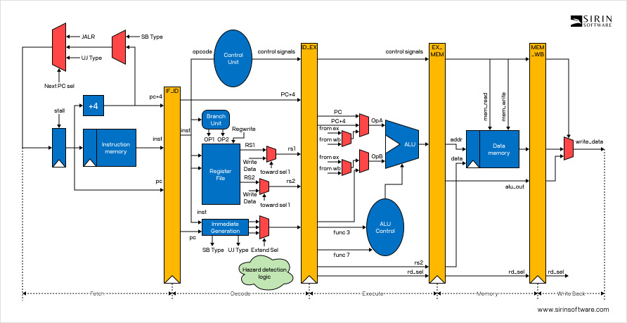
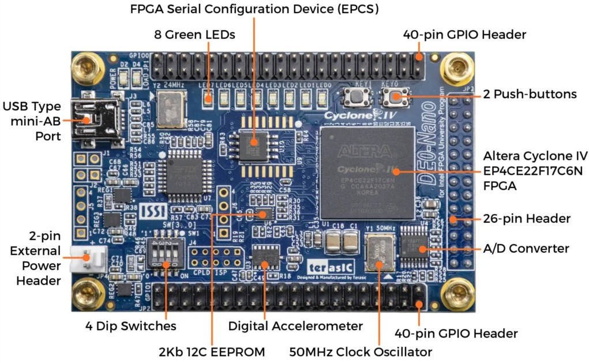
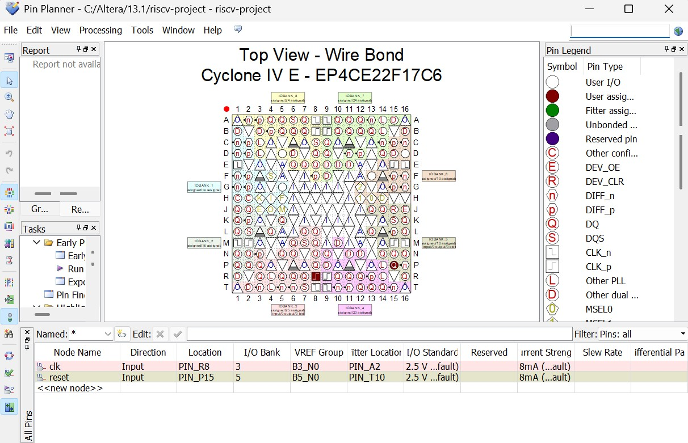
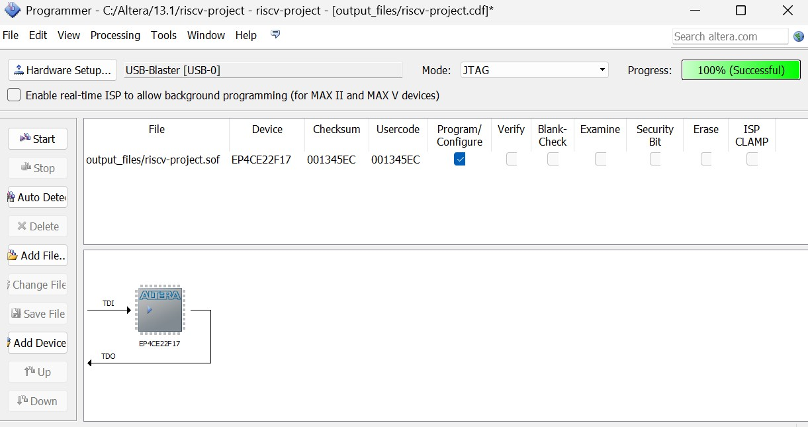
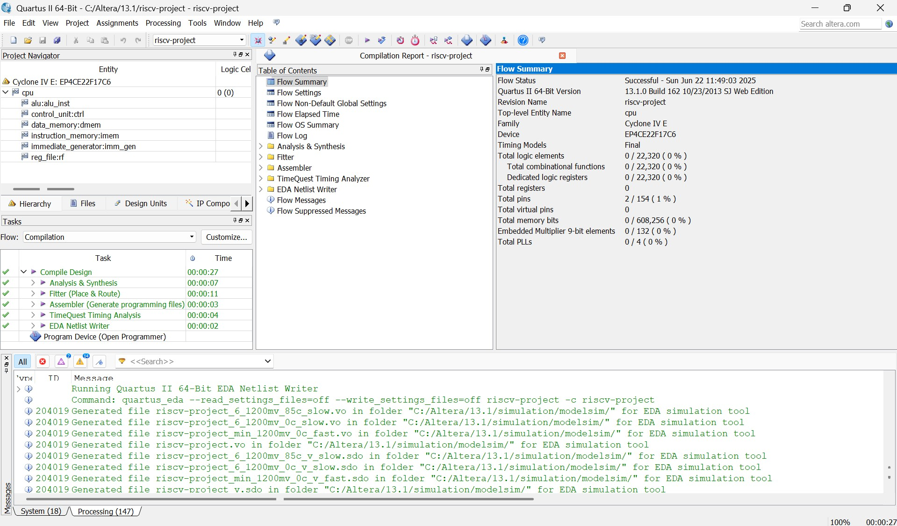
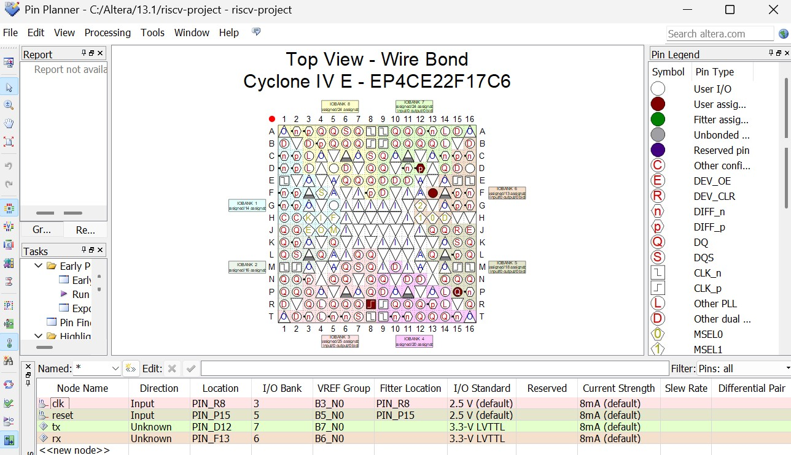
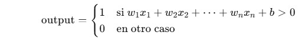

<!-- @import "design/style.css" -->

# **Diseño e Implementación de un Procesador RISC-V Escalar y Segmentado en FPGA**

# Introducción

<p style="text-indent: 2em;">El presente trabajo de investigación consiste en la creación de un procesador escalar y segmentado con una microarquitectura RISC-V, dicha creación será propuesta y representada en el documento desde un punto de vista teórico. El principal objetivo del presente trabajo de investigación consiste en la evaluación del funcionamiento y comportamiento del procesador creado en tareas representativas en el campo de la automoción y la inteligencia artificial.</p>

# Objetivos

- Diseñar la microarquitectura de un procesador RISC-V.
- Simular el funcionamiento del procesador con diferentes programas (testbench).
- Sintetizar e implementar en el procesador una FPGA para emular RISC-V.
- Cargar y validar el funcionamiento de un programa en código C sobre la FPGA.
- Evaluar el funcionamiento del procesador en programas representativos de varios sectores.

# Diseño de la microarquitectura del procesador RISC-V

<p style="text-indent: 2em;">Para la creación y desarrollo del diseño del procesador RISC-V se ha utilizado Verilog, compilando un testbench de la CPU mediante iVerilog (Icarus Verilog).

<p style="text-indent: 2em;">La estructura de los ficheros del proyecto que define la arquitectura del procesador y que se encuentran dentro de la carpeta ubicada en ./RISCV_Architecture/ es la siguiente:

```
                        >/.RISCV_Architecture
                            >/src
                                >alu.v
                                >control_unit.v
                                >cpu.v
                                >data_memory.v
                                >immediate_generator.v
                                >instruction_memory.v
                                >reg_file.v
                            >/test
                                >cpu_testbench.v
                                >data.mem
                                >program.mem
                            >run.sh

```

## **Fichero alu.v**

<p style="text-indent: 2em;">Los ficheros con formato .v que se encuentran dentro de la carpeta /scr (source) son los encargados del funcionamiento y arquitectura propia del procesador RISC-V. En alu.v (la ALU del procesador) se han definido las entradas por el canal A y B, además del control que determina la operación a realizar y el resultado a devolver, adicionalmente, se ha determinado el funcionamiento de la ALU para las instrucciones: add, sub, and, or, xor, sll y srl (en caso de no ser ninguna de las anteriores la ALU devuelve 0).

**alu.v:**
```verilog
module alu (
    input [31:0] a,             // Operando A
    input [31:0] b,             // Operando B
    input [3:0] alu_ctrl,       // Control para operacion
    output reg [31:0] result    // Resultado
);
    always @(*) begin
        case (alu_ctrl)
            4'b0000: result = a + b;        // add
            4'b0001: result = a - b;        // sub
            4'b0010: result = a & b;        // and
            4'b0011: result = a | b;        // or
            4'b0100: result = a ^ b;        // xor
            4'b0101: result = a << b[4:0];  // sll
            4'b0110: result = a >> b[4:0];  // srl
            default: result = 0;
        endcase
    end
endmodule
```

## **Fichero control_unit.v**

<p style="text-indent: 2em;">En la control_unit.v (Unidad de Control) se ha definido el código de operación, la función de 3 bits y la de 7 bits (por los diferentes formatos de instrucción), la selección del operando B de la entrada a la ALU y las señales de habilitación de lectura y escritura en memoria, la escritura en registro y la selección del dato a desplazar en la etapa WB (Write Back), además del control de operación de la ALU.

<p style="text-indent: 2em;">Cómo instrucciones se ha optado por la creación de las que vienen dadas por el repertorio RISC-V32I (instrucciones básicas), entre las que se encuentran: addi, lw, sw, beq y jal (el resto son mandadas a la ALU para su resolución).

**control_unit.v:**
```verilog
module control_unit (
    input [6:0] opcode,         // Codigo de operacion
    input [2:0] funct3,         // funcion de 3 bits
    input [6:0] funct7,         // funcion de 7 bits
    output reg alu_src,         // Seleccion de entrada B de la ALU
    output reg mem_read,        // Señal de lectura de memoria
    output reg mem_write,       // Señal de escritura de memoria
    output reg reg_write,       // Señal de escritura en registros
    output reg mem_to_reg,      // Seleccion para escribir en registro (WB)
    output reg [3:0] alu_ctrl   // Control de la operacion de la ALU
);
    always @(*) begin
        alu_src = 0;
        mem_read = 0;
        mem_write = 0;
        reg_write = 0;
        mem_to_reg = 0;
        alu_ctrl = 4'b0000;
        case (opcode)
            7'b0110011: begin       // Tipo R
                alu_src = 0;
                reg_write = 1;
                mem_to_reg = 0;
                case ({funct7, funct3})
                    10'b0000000000: alu_ctrl = 4'b0000; // add
                    10'b0100000000: alu_ctrl = 4'b0001; // sub
                    10'b0000000111: alu_ctrl = 4'b0010; // and
                    10'b0000000110: alu_ctrl = 4'b0011; // or
                    10'b0000000100: alu_ctrl = 4'b0100; // xor
                    10'b0000000001: alu_ctrl = 4'b0101; // sll
                    10'b0000000101: alu_ctrl = 4'b0110; // srl
                    default:        alu_ctrl = 4'b1111;
                endcase
            end
            7'b0010011: begin       // addi
                alu_src = 1;
                reg_write = 1;
                alu_ctrl = 4'b0000; // add
            end
            7'b0000011: begin       // lw
                alu_src = 1;
                mem_read = 1;
                reg_write = 1;
                mem_to_reg = 1;
                alu_ctrl = 4'b0000;
            end
            7'b0100011: begin       // sw
                alu_src = 1;
                mem_write = 1;
                alu_ctrl = 4'b0000;
            end
            7'b1100011: begin       // beq
                alu_src = 0;
                alu_ctrl = 4'b0001; // sub
            end
            7'b1101111: begin       // jal
                alu_src = 0;
                reg_write = 1;
                mem_to_reg = 0;
                alu_ctrl = 4'b0000; // opcional
            end
            default: ;
        endcase
    end
endmodule
```

### **Repertorio de instrucciones de RISC-V:**


## **Fichero cpu.v**
<p style="text-indent: 2em;">La cpu.v (Central Unit Process) especifica las etapas que se desarrollan al realizar cada instrucción, además del clk (señal de reloj) y del reset (señal de reinicio). El diseño de la arquitectura del procesador creado es la de un procesador segmentado de 5 etapas (IF, ID, EX, MEM, WB) que busca 1 instrucción/ciclo.

**cpu.v -> Definición del módulo:**
```verilog
module cpu (
    input clk,      // Señal de reloj
    input reset     // Señal de reinicio
    );  
```

<p style="text-indent: 2em;">La etapa de IF (Instruction Fetch) "lee" la instrucción basándose en el contador del programa PC (registro de 32 bits inicializado a 0), así como la dirección de la instrucción, tras esto, se realiza el registro del pipeline entre la etapa de IF y la ID (Instruction Decode) para pasar a dicha etapa.

**cpu.v -> IF STAGE:**
```verilog
    // ============================================================
    // IF (Instruction Fetch) stage
    // ============================================================
    reg [31:0] pc;          // Contador de programa
    wire [31:0] instr;      // instruccion obtenida de memoria

    // Instancia de la memoria de instrucciones
    instruction_memory imem (
        .addr(pc),              // Direccion de la instruccion = PC
        .instruction(instr)     // Instruccion leida
    );

    // IF/ID registro de pipeline (entre IF e ID)
    reg [31:0] ifid_pc, ifid_instr;
```

<p style="text-indent: 2em;">En la etapa de ID (Instruction Decode) se definen los campos para obtener el tipo de instrucción de la que se trata mediante el código de operación, los registros a utilizar y la función de 3 y 7 bits respectivamente, además de definir la salida del banco de registros por las dos vías. Adicionalmente, la etapa hace una llamada al fichero reg_file.v cómo rf en donde se le pasan los parámetros necesarios para el correcto funcionamiento del banco de registros (véase en la explicación del fichero reg_file.v).

**cpu.v -> ID STAGE (Primera Parte):**
```verilog
    // ============================================================
    // ID (Instruction Decode) stage
    // ============================================================
    wire [6:0] opcode = ifid_instr[6:0];
    wire [4:0] rs1 = ifid_instr[19:15];
    wire [4:0] rs2 = ifid_instr[24:20];
    wire [4:0] rd  = ifid_instr[11:7];

    wire [2:0] funct3 = ifid_instr[14:12];
    wire [6:0] funct7 = ifid_instr[31:25];

    wire [31:0] reg_data1, reg_data2;

    // Obtener los registros a utilizar y el destino
    reg_file rf (
        .clk(clk),                      // Señal de reloj
        .rs1(rs1),                      // Registro fuente 1
        .rs2(rs2),                      // Registro fuente 2       
        .rd(memwb_rd),                  // Registro destino
        .rd_data(memwb_result),         // Dato a escribir en el destino
        .reg_write(memwb_reg_write),    // Señal de escritura    
        .data1(reg_data1),              // Salida del dato de la fuente 1
        .data2(reg_data2)               // Salida del dato de la fuente 2
    );
```

<p style="text-indent: 2em;">En esta etapa se ha de verificar la lógica del salto debido a que el producido por una instrución branch, no es el mismo que el producido por la instrucción jal, además, hay que verificar si el salto es o no tomado por el procesador, para ello, se ha implementado un sistema de burbujas para tener un sistema de esperas activas y que el procesador no se quede bloqueado ni se salte instrucciones.

**cpu.v -> ID STAGE (Segunda Parte):**
```verilog
    // Logica de saltos
    wire is_branch = (opcode == 7'b1100011);

    wire is_jump   = (opcode == 7'b1101111);

    // Comprobar si el salto es o no tomado
    wire branch_taken = (is_branch && reg_data1 == reg_data2);

    wire insert_bubble = (branch_taken || is_jump);

    // Registro de IF/ID con burbujas de salto
    always @(posedge clk or posedge reset) begin
    
        if (reset) begin
            pc <= 0;
            ifid_pc <= 0;
            ifid_instr <= 32'b0;
        end else begin
            if (branch_taken) begin
                pc <= pc + branch_offset;
                ifid_pc <= 0;
                ifid_instr <= 32'b0;
            end else if (is_jump) begin
                pc <= pc + jump_offset;
                ifid_pc <= 0;
                ifid_instr <= 32'b0;
            end else begin
                pc <= pc + 4;
                ifid_pc <= pc;
                ifid_instr <= instr;
            end
        end
    end
```

<p style="text-indent: 2em;">En cuanto a las instrucciones que usan inmediatos (p.ej.: addi), se llama al fichero immediate_generator.v como imm_gen al que se le pasa el id de la instrucción y el inmediato en cuestión (para más información véase la explicación del fichero immediate_generator.v) y se crean los offsets para los saltos y ramas con el mismo inmediato (ya dado por imm_gen).

**cpu.v -> ID STAGE (Tercera Parte):**
```verilog
    // Inmediato decodificado
    wire [31:0] imm;
    immediate_generator imm_gen (
        .instr(ifid_instr),
        .imm(imm)
    );

    // Offsets para salto y ramas (ambos usan el mismo)
    wire [31:0] branch_offset = imm;
    wire [31:0] jump_offset = imm;
```

<p style="text-indent: 2em;">Como última parte de esta etapa, se llama a control_unit.v como ctrl para pasarle la instrucción decodificada y que esta se encargue de que se ejecute correctamente, tras esto, se realizan los registros del pipeline entre las etapas ID y EX (EXecute) para continuar con la misma.

**cpu.v -> ID STAGE (Última Parte):**
```verilog
    // Unidad de control: genera señales de control a partir de la instrucción
    wire alu_src, mem_read, mem_write, reg_write, mem_to_reg;
    wire [3:0] alu_ctrl;

    // Llamada a la unidad de control
    control_unit ctrl (
        .opcode(opcode),            // Codigo de operacion
        .funct3(funct3),            // Funcion 3bits
        .funct7(funct7),            // Funcion 7bits
        .alu_src(alu_src),          // Seleccion de entrada B de la ALU
        .mem_read(mem_read),        // Señal de lectura de memoria
        .mem_write(mem_write),      // Señal de escritura de memoria
        .reg_write(reg_write),      // Señal de escritura en registros
        .mem_to_reg(mem_to_reg),    // Seleccion para WB
        .alu_ctrl(alu_ctrl)         // Operacion de la ALU
    );

    // ID/EX registros de pipeline (entre ID y EX)
    reg [31:0] idex_pc, idex_reg_data1, idex_reg_data2, idex_imm;
    reg [3:0]  idex_alu_ctrl;
    reg idex_alu_src, idex_mem_read, idex_mem_write, idex_reg_write, idex_mem_to_reg;
    reg [4:0]  idex_rd, idex_rs1, idex_rs2;

    always @(posedge clk) begin
        idex_pc         <= ifid_pc;
        idex_reg_data1  <= reg_data1;
        idex_reg_data2  <= reg_data2;
        idex_imm        <= imm;
        idex_alu_ctrl   <= alu_ctrl;
        idex_alu_src    <= alu_src;
        idex_mem_read   <= mem_read;
        idex_mem_write  <= mem_write;
        idex_reg_write  <= reg_write;
        idex_mem_to_reg <= mem_to_reg;
        idex_rd         <= rd;
        idex_rs1        <= rs1;
        idex_rs2        <= rs2;
    end
```

<p style="text-indent: 2em;">En la etapa de EX (EXecute) se selecciona el segundo operando de la ALU dependiendo de si es un registro o un inmediato y se define el resultado de 32 bits de dicha operación, tras esto, se llama al fichero alu.v (ALU del procesador) para pasarle por parámetro los registros (o inmediato) a utilizar para los cálculos de la unidad, por último, se realiza el registro de pipeline entre las etapas EX y MEM (MEMory) para pasar a la misma. De manera adicional, se ha implementado un sistema de forwarding (anticipación), para poder usar los resultados de las operaciones anteriores que generen dependencias RAW (Read After Write).

**cpu.v -> EX STAGE:**
```verilog
    // ============================================================
    // EX (Execute) stage con FORWARDING
    // ============================================================
    // Aplicar la tecnica de forwarding (anticipacion)
    wire forward_a_exmem = (exmem_reg_write && exmem_rd != 0 && exmem_rd == idex_rs1);
    wire forward_b_exmem = (exmem_reg_write && exmem_rd != 0 && exmem_rd == idex_rs2);

    wire forward_a_memwb = (memwb_reg_write && memwb_rd != 0 && memwb_rd == idex_rs1);
    wire forward_b_memwb = (memwb_reg_write && memwb_rd != 0 && memwb_rd == idex_rs2);

    wire [31:0] forward_a = forward_a_exmem ? exmem_result :
                            forward_a_memwb ? memwb_result :
                            idex_reg_data1;

    wire [31:0] forward_b_reg = forward_b_exmem ? exmem_result :
                                forward_b_memwb ? memwb_result :
                                idex_reg_data2;

    wire [31:0] alu_in2 = idex_alu_src ? idex_imm : forward_b_reg;

    wire [31:0] alu_result;

    // Uso de la ALU
    alu alu_inst (
        .a(forward_a),
        .b(alu_in2),
        .alu_ctrl(idex_alu_ctrl),
        .result(alu_result)
    );

    reg [31:0] exmem_result, exmem_reg_data2;
    reg exmem_mem_read, exmem_mem_write, exmem_reg_write, exmem_mem_to_reg;
    reg [4:0]  exmem_rd;

    // EX/MEM registro de pipeline (entre EX y MEM)
    always @(posedge clk) begin
        exmem_result     <= alu_result;
        exmem_reg_data2  <= forward_b_reg; // ya aplicado forwarding
        exmem_mem_read   <= idex_mem_read;
        exmem_mem_write  <= idex_mem_write;
        exmem_reg_write  <= idex_reg_write;
        exmem_mem_to_reg <= idex_mem_to_reg;
        exmem_rd         <= idex_rd;
    end
```

<p style="text-indent: 2em;">La etapa de MEM (MEMory) consiste en definir el dato que se obtiene de memoria a través del fichero data_memory.v, al que se le pasa por parámetro el reloj, la dirección de memoria calculada por la ALU (en la etapa EX), el dato a escribir en memoria, la habilitación de la señal de lectura y escritura en memoria y la salida de dicho dato de memoria (para más información véase la explicación del fichero data_memory.v). Una vez realizado lo anterior, se realiza el registro del pipeline entre las etapas EX y WB (Write Back) para terminar con esta. En este caso, al hacerse en el post-pipeline el guardado de datos en memoria, se realiza a su vez la etapa de WB.

**cpu.v -> EX y WB STAGE:**
```verilog
    // ============================================================
    // MEM y WB
    // ============================================================
    wire [31:0] mem_data_out;

    data_memory dmem (
        .clk(clk),
        .addr(exmem_result),            // Direccion calculada por la ALU
        .write_data(exmem_reg_data2),   // Dato a escribir en caso de SW
        .mem_read(exmem_mem_read),      // Señal de lectura
        .mem_write(exmem_mem_write),    // Señal de escritura
        .read_data(mem_data_out)        // Salida de memoria
    );

    // MEM/WB registro de pipeline (entre MEM y WB)
    reg [31:0] memwb_result;
    reg memwb_reg_write;
    reg [4:0]  memwb_rd;

    always @(posedge clk) begin
        // Seleccion del dato a escribir en el registro destino
        memwb_result    <= exmem_mem_to_reg ? mem_data_out : exmem_result;
        memwb_reg_write <= exmem_reg_write;
        memwb_rd        <= exmem_rd;
    end
endmodule
```

## **Fichero data_memory.v**

<p style="text-indent: 2em;">La data_memory.v (memoria de datos) es un fichero que define la cantidad de palabras que almacena la memoria de datos, en este caso, se ha optado por una memoria de 1KB total, es decir, 256 palabras. Para usar el módulo, es necesaria la señal de reloj, así como la dirección, el dato a escribir, la señal de escritura y lectura en memoria y una variable en donde almacenar el dato leído. Los datos de memoria vienen dados por un archivo hexadecimal (test/data.mem) que contiene 1KB de palabras a 0.

<p style="text-indent: 2em;">En el caso de que la señal de escritura en memoria esté activa, se escribe el dato en cuestión y en caso de que la señal de lectura esté activa, se lee el dato que ocupa la dirección de memoria dada y si no hay información, devuelve la lectura de todo 0. Como última adición a este fichero, hay una tarea que se encarga de mostrar las primeras 16 palabras (64 bytes), esto con el objetivo de mostrar los resultados en pruebas futuras.

**data_memory.v:**
```verilog
module data_memory (
    input clk,
    input [31:0] addr,
    input [31:0] write_data,
    input mem_read,
    input mem_write,
    output reg [31:0] read_data
);
    // Memoria de 256 palabras de 32 bits (1 KB total)
    reg [31:0] memory [0:255];

    // Carga inicial desde archivo hexadecimal
    initial begin
        $readmemh("test/data.mem", memory);
    end

    // Escritura en flanco de subida si mem_write esta activo
    always @(posedge clk) begin
        if (mem_write) begin
            memory[addr[9:2]] <= write_data;  // Direccion alineada por palabra
        end
    end

    // Lectura combinacional si mem_read esta activo
    always @(*) begin
        if (mem_read) begin
            read_data = memory[addr[9:2]];
        end else begin
            read_data = 32'b0;
        end
    end

    // Tarea para imprimir los primeros 16 valores (64 bytes)
    task print_memory;
        integer i;
        begin
            $display("==== Contenido de la memoria de datos ====");
            for (i = 0; i < 16; i = i + 1) begin
                $display("mem[0x%0h] = %0d (0x%08x)", i * 4, memory[i], memory[i]);
            end
        end
    endtask
endmodule
```

## **Fichero immediate_generator.v**

<p style="text-indent: 2em;">El fichero immediate_generator (generador de inmediatos) contiene un módulo al que se le pasa una instrucción de 32 bits, se extrae el código de operación y dependiendo del mismo, se clasifica por tipo de instrucción (I, S, B, J).

**immediate_generator.v:**
```verilog
module immediate_generator (
    input [31:0] instr,     // Instruccion de 32 bits
    output reg [31:0] imm   // Valor inmediato
);
    wire [6:0] opcode = instr[6:0]; // Extraer el opcode de la instruccion

    always @(*) begin
        case (opcode)
            // I-type
            7'b0000011, 7'b0010011:    
                imm = {{20{instr[31]}}, instr[31:20]};
            // S-type
            7'b0100011:                 
                imm = {{20{instr[31]}}, instr[31:25], instr[11:7]};
            // B-type
            7'b1100011: 
                imm = {{19{instr[31]}}, instr[31], instr[7], instr[30:25], instr[11:8], 1'b0};
            // J-type
            7'b1101111: 
                imm = {{11{instr[31]}}, instr[31], instr[19:12], instr[20], instr[30:21], 1'b0};
            default:
                imm = 32'b0;
        endcase
    end
endmodule
```

## **Fichero instruction_memory.v**

<p style="text-indent: 2em;">Este fichero contiene la memoria de instrucciones, para el uso de su módulo es necesaria la dirección de la instrucción a leer y una variable para almacenar dicha instrucción una vez se obtenga. El tamaño de la memoria de instrucciones, de manera similar a la memoria de datos, es de 1KB, es decir, 256 palabras, las instrucciones vienen dadas por el fichero con nombre (test/program.mem) en donde las primeras líneas tienen lo siguiente:

**program.mem:**
```bash
00a00093    // addi x1, x0, 10     ; x1 = 10
01400113    // addi x2, x0, 20     ; x2 = 20
0020813     // add x3, x1, x2      ; x3 = x1 + x2 = 30
00312023    // sw x3, 0(x2)        ; mem[20] = x3
00012183    // lw x3, 0(x2)        ; x3 = mem[20]
0000006f    // jal x0, 0           ; bucle infinito
00000013    // nop
...
00000013    // nop
```

<p style="text-indent: 2em;">Una vez obtenida la instrucción, se muestran por orden las 3 primeras instrucciones como depuración de que el procesador lee correctamente las mismas. Por último, se alinea a 4 bytes la memoria.

**instruction_memory.v:**
```verilog
module instruction_memory (
    input  [31:0] addr,         // Direccion de la instruccion
    output [31:0] instruction   // instruccion leida
);
    reg [31:0] memory [0:255];  // Memoria de inst. de 256 palabras

    initial begin
        // Obtener las instrucciones de memoria y realizar prints de depuración
     initial begin
        $readmemh("test/program.mem", memory);
        $display("\n==== INSTRUCCIONES CARGADAS ====");
        $display("0: %h", memory[0], " -> addi x1, x0, 10");
        $display("1: %h", memory[1], " -> addi x2, x0, 20");
        $display("2: %h", memory[2], " -> add x3, x1, x2");
        $display("3: %h", memory[3], " -> sw x3, 0(x2)");
        $display("4: %h", memory[4], " -> lw x3, 0(x2)");
        $display("5: %h", memory[5], " -> jal x0, 0");
        $display("6: %h", memory[6], " -> nop");
    end

    // Realizar un alineado de 4 bytes
    assign instruction = memory[addr[9:2]];
endmodule
```

## **Fichero reg_file.v**

<p style="text-indent: 2em;">El fichero reg_file.v se encarga de obtener las salidas de los registros pertenecientes a las fuentes 1 y 2 del banco de registros, para ello es necesario pasarle dos parámetros para guardar la salida de los registros, así como los registros fuentes (dirección) y el destino y una señal de activación de escritura en registro. Por último, se realiza una tarea para imprimir los primero registros de la simulación a método de depuración del correcto funcionamiento del procesador.

**reg_file.v:**
```verilog
module reg_file (
    input clk,              // Reloj del sistema
    input [4:0] rs1,        // Registro fuente 1
    input [4:0] rs2,        // Registro fuente 2
    input [4:0] rd,         // Registro destino
    input [31:0] rd_data,   // Dato a escribir en el registro destino
    input reg_write,        // Habilita la escritura en el registro destino
    output [31:0] data1,    // Salida del registro fuente 1
    output [31:0] data2     // Salida del registro fuente 2
);

    reg [31:0] registers[0:31];

    // Asignacion de los datos a los registros fuente
    assign data1 = registers[rs1];
    assign data2 = registers[rs2];

    integer i;
    initial begin
        for (i = 0; i < 32; i = i + 1) begin
            registers[i] = 0;
        end
    end

    always @(posedge clk) begin
        if (reg_write && rd != 0)
            registers[rd] <= rd_data;
    end

    // Task para imprimir los registros en la simulacion
    task print_registers;
        integer j;
        begin
            $display("==== Banco de registros ====");
            for (j = 0; j < 16; j = j + 1) begin
                $display("x%0d = %0d", j, registers[j]);
            end
        end
    endtask
endmodule
```

## **Fichero cpu_testbench.v**

<p style="text-indent: 2em;">Este fichero ejecuta una prueba del procesador, para ello, se define una escala de tiempo de 1ns/1ps además de instanciar el DUT (Device Under Test) con su propio clk y su reset, el reloj se inicializa con un periodo de 10ns y el proceso principal de prueba consiste en ejecutar el programa y tras esperar a que acaben de ejecutarse las instrucciones, el programa imprime un mensaje de estado final del procesador y llama a las tareas creadas en instruction_memory.v y data_memory.v para mostrar su estado.

**cpu_testbench.v:**
```verilog
`timescale 1ns / 1ps

module cpu_testbench;

    // Señales de testbench
    reg clk;
    reg reset;

    // Instancia del DUT (Device Under Test)
    cpu uut (
        .clk(clk),
        .reset(reset)
    );

    // Generador de reloj: periodo de 10 ns
    always begin
        #5 clk = ~clk;
    end

    // Proceso principal de prueba
    initial begin
        // Inicializacion
        clk = 0;
        reset = 1;

        // Espera un par de ciclos con reset activo
        #20;
        reset = 0;

        // Espera suficiente para que se ejecuten instrucciones
        #5000000;

        // Imprime registros y memoria
        $display("\n==== ESTADO FINAL DEL PROCESADOR ====");
        uut.rf.print_registers();     // Banco de registros
        uut.dmem.print_memory();      // Memoria de datos

        // Finaliza la simulacion
        $finish;
    end
endmodule
```

### **Diagrama del procesador RISC-V creado**:



Para ejecutar las pruebas del procesador, sólo se ha descargar el proyecto y realizar los pasos siguientes:

```shell
cd ./RISCV_Architecture
iverilog -o cpu_testbench.vvp src/*.v test/cpu_testbench.v
vvp cpu_testbench.vvp
```

Dichos pasos están recogidos dentro del fichero run.sh que posee la siguiente información:

```bash
# Locate in the project directory
cd ./RISCV_Architecture

# Project compilation
iverilog -o cpu_testbench.vvp src/*.v test/cpu_testbench.v

# Simulate
vvp cpu_testbench.vvp

# Look Waves (using $dumpfile)
gtkwave waveform.vcd
```

# Programa de prueba del procesador RISC-V creado

<p style="text-indent: 2em;">Para comprobar que efectivamente el procesador funciona correctamente, se carga el programa del fichero cpu_testbench.v. Para ejecutar dicho programa de prueba, se lleva a cabo cualesquiera de los métodos anteriores (correr el run.sh o manualmente por el terminal). El resultado de dicha ejecución se ve a continuación:

### **Ejecución del cpu_testbench:**
```bash
==== INSTRUCCIONES CARGADAS ====
0: 00a00093 -> addi x1, x0, 10
1: 01400113 -> addi x2, x0, 20
2: 002081b3 -> add x3, x1, x2
3: 00312023 -> sw x3, 0(x2)
4: 00012183 -> lw x3, 0(x2)
5: 0000006f -> jal x0, 0
6: 00000013 -> nop

==== ESTADO FINAL DEL PROCESADOR ====

==== BANCO DE REGISTROS ====
x0 = 0
x1 = 10
x2 = 20
x3 = 30
x4 = 0
x5 = 0
x6 = 0
x7 = 0
x8 = 0
x9 = 0
x10 = 0
x11 = 0
x12 = 0
x13 = 0
x14 = 0
x15 = 0

==== CONTENIDO DE LA MEMORIA DE DATOS ====
mem[0x0] = 0 (0x00000000)
mem[0x4] = 0 (0x00000000)
mem[0x8] = 0 (0x00000000)
mem[0xc] = 0 (0x00000000)
mem[0x10] = 0 (0x00000000)
mem[0x14] = 30 (0x0000001e)
mem[0x18] = 0 (0x00000000)
mem[0x1c] = 0 (0x00000000)
mem[0x20] = 0 (0x00000000)
mem[0x24] = 0 (0x00000000)
mem[0x28] = 0 (0x00000000)
mem[0x2c] = 0 (0x00000000)
mem[0x30] = 0 (0x00000000)
mem[0x34] = 0 (0x00000000)
mem[0x38] = 0 (0x00000000)
mem[0x3c] = 0 (0x00000000)

test/cpu_testbench.v:39: $finish called at 5000020000 (1ps)
```

# Implementación y emulación en una FPGA del procesador RISC-V

<p style="text-indent: 2em;">Se va a implementar la arquitectura del procesador creado anteriormente (arquitectura simplificada del RISC-V, segmentado y con 5 etapas de ejecución), dentro de la FPGA de Terasic llamada DE0-Nano, que utiliza la familia Cyclone IV de Altera (ahora Intel). Para dicha implementación se va a utilizar el software proporcionado por Intel llamado Quartus II, en la versión 13.1 Web edition (última versión con soporte para la FPGA mencionada).

### **Placa utilizada: FPGA DE0-Nano:**



<p style="text-indent: 2em;">Para llevar a cabo el proyecto es de necesario conocimiento saber el código de la FPGA a utilizar, en el caso de la DE0-Nano con el Altera Cyclone IV, se va a utilizar el EP4CE22F17C6, cuyo único cambio respecto a la FPGA física es que no posee el sufijo N, dado sufijo indica que es sin plomo, así que no afecta al flujo normal de trabajo que se va a realizar para cargar el programa en la FPGA ni cambia su funcionamiento.

El dispositivo en cuestión posee las siguientes características:

- **Familia:** Ciclone IV E.
- **Lógica:** 22.320 LEs.
- **Encapsulado:** FBGA 256 F17 (17x17mm).
- **Ritmo:** Grado de ritmo "6".

<p style="text-indent: 2em;">Ya conocida la nano-board a utilizar y sus características, para llevar a cabo el proyecto, se han utilizado los ficheros Verilog creados anteriormente, indicando el fichero cpu.v como el Top-module del proyecto, es decir, el main del mismo.

<p style="text-indent: 2em;">Una vez se hayan puesto los ficheros Verilog que designan la arquitectura y funcionamiento del procesador y se haya configurado el cpu.v como Top-module, se ha de configurar la señal de reloj y la de reset a uno de los pines físicos de la placa DE0-Nano que estén configurados para su funcionamiento, los pines elegidos son los siguientes:

- **Señal de Reloj:** Se ha asignado al pin físico "R8" cuyo nombre en la placa es "CLOCK_50", posee una entrada de reloj principal a 50MHz y una señal digital de entrada con tolerancia de 3.3V LVCMOS.

- **Señal de Reset:** Se ha asignado al pin físico "P15" cuyo nombre en la placa es "KEY[0]", posee una señal activa baja, es decir, sin pulsar está a 1 y al pulsarlo, su nivel lógico pasa a 0. Su uso reinicia el sistema o los módulos lógicos como FSMs y/o contadores.

<p style="text-indent: 2em;">Para la modificación de los pines de manera manual dentro de la FPGA, y utilizando el software de Intel anteriormente mencionado, se ha accedido a la ventana del "PinPlanner" proporcionada por el programa, eligiendo las señales definidas en el proyecto creado (clk y reset, respectivamente) y buscando en la lista los pines en cuestión (alternativamente, se puede pinchar sobre los pines mirando el esquema lógico de la placa).

### **Utilidad "PinPlanner" tras la asignación de pines:**



<p style="text-indent: 2em;">Ya configurados los pines físicos del proyecto a los pines de la placa, se ha de comprobar el acceso a la placa en sí, es decir, comprobar que se puede conectar mediante el USB-Blaster, para ello, se ha de entrar en la utilidad proporcionada por el programa llamada "Programmer" y en la pestaña "Hardware Setup", una vez dentro, en el apartado llamado "Currently selected hardware" buscar la opción "USB-Blaster [USB-x]".

<p style="text-indent: 2em;">En caso de que no aparezca la opción "USB-Blaster [USB-x]", se ha de comprobar si dicho USB es reconocido y tiene el driver instalado en el dispositivo, para ello (en caso de estar utilizando un SO de windows), se ha de acceder al administrador de dispositivos y comprobar si se reconoce el dispositivo en el apartado de "Otros dispositivos" o "USB devices" como "USB-Blaster" o "unknown device". Realizadas las comprobaciones, y con objetivo de actualizar el driver, al realizar la instalación completa del software de Intel, debe existir una ruta tal que: C:\Altera\13.1\quartus\drivers y dentro, deberían haber dos carpetas, una para los drivers del USB-Blaster I y otros para el USB-Blaster II. Instalar los controladores pertinentes.

<p style="text-indent: 2em;">Con los controladores instalados, probar a conectar otra vez el el "USB-Blaster [USB-x]" dentro de la pestaña "Hardware Setup". Si todo se ha realizado correctamente, marcar la opción de "Auto-detect" dentro de la utilidad "Programmer" del software, una vez realizado, ya debe estar correctamente configurado y listo para cargar.

### **Utilidad "Programmer" tras la configuración:**



<p style="text-indent: 2em;">El proyecto está ubicado dentro de una carpeta llamada "RISCV_FPGA_Project" que contiene todo lo necesario para la ejecución del mismo, contiene lo siguiente:

```c
                        >/.RISCV_FPGA_Project
                            >/output_files
                            >/simulation
                            >/test
                                >cpu_testbench.v
                                >data.mem
                                >program.mem
                            >riscv-project.qpf
                            >riscv-project.qsf
                            >riscv-project.qws
```

<p style="text-indent: 2em;">Con todo configurado correctamente, y con el USB-Blaster conectado al dispositivo y a la placa (DE0-Nano), se va a proceder a la carga de la arquitectura del procesador creado dentro de la propia FPGA mencionada, para ello, hay que acceder al apartado de "Processing" y pulsar "Start compilation", si se ha realizado todo correctamente, no debería saltar ningún error en el log de la compilación.

### **Compilación del proyecto en el Intel Quartus II:**



<p style="text-indent: 2em;">Una vez compilado el proyecto de manera exitosa, deben aparecer en la carpeta llamada "output_files", los siguientes ficheros:

- **Archivo.sof:** Es la imagen de la RAM de la FPGA, sirve para programar temporalmente la misma.

- **Archivo.pof:** Es la imagen de la Flash (no volátil), sirve como configuración permanente (si hay Flash).

- **Archivo.map.rpt:** Es el informe de síntesis que verifica la lógica creada.

- **Archivo.fit.rpt:** Es el informe de asignación física y verifica el uso de recursos.

- **Archivo.sta.rpt:** Es el informe del timing que verifica que se cumplan las restricciones del reloj.

- **Archivo.pin:** Es la lista de pines, sirve para asignar correctamente los switches y LEDs.

- **Archivo.qsf:** Es la configuración del proyecto, guarda pines, clocks, entre otros.

# Carga y validación de un código C en la FPGA

<p style="text-indent: 2em;">Como comprobación de que se ha cargado correctamente la arquitectura RISC-V creada, se realiza la carga y posterior ejecución de un código en C cuyo trabajo es mandar una cadena de texto por el UART (Universal Asynchrous Receiver-Transmitter), que convierte los datos paralelos con los que trabaja la CPU en datos serie para transmitir mediante un único cable TX y recibir datos por un único cable RX, ambos hay que asignarlos a un Pin, para ello, haciendo uso de la utilidad "PinPlanner" del Quartus II, se asignan tal que: 

- **TX:** Se conecta al pin D12 del conector GPIO de la DE0-Nano, que es un pin de propósito general que se puede programar como salida o entrada digital, en este caso, se usa como salida digital para transmitir datos por el canal UART.

- **RX:** Se conecta al pin F13 del conector GPIO de la DE0-Nano, que, de igual manera que el D12, es un pin de propósito general, en este caso, programado como entrada de datos por el canal UART.

### **Nuevos Pines para el uso del canal UART:**



<p style="text-indent: 2em;">Ya asignados los pines para la entrada y salida de datos mediante el UART, se ha de volver a compilar y cargar el programa dentro de la FPGA (véase apartado anterior). Ya cargada la nueva arquitectura en la FPGA y con el objetivo de organizar los códigos de ejecución, se ha creado una carpeta Resources dentro del proyecto en la que se encontrará el código base en C y en otros formatos que se explicarán más adelante.

**Código de prueba en C, test.c:**
```c
// ==========================================================
// UART mapeada a 0x2000_0000. 8N1, 115200 Bd.
// Se asume que basta escribir un byte para transmitirlo.
// ==========================================================

#define UART_ADDR  ((volatile unsigned char *)0x20000000u)

// Enviar un caracter
static void uart_write_char(char c)
{
    *UART_ADDR = c;
}

// Enviar un string C
static void uart_write_str(const char *p)
{
    while (*p) uart_write_char(*p++);
}

// Punto de entrada que el linker usara con -Wl,-e,_start
void _start(void)
{
    uart_write_str("\r\n*** Hola desde mi CPU RISC-V! ***\r\n");
    while (1);                 // loop infinito 
}
```

<p style="text-indent: 2em;">Para compilar el código creado, se ha de acceder a un terminal, situarse en la carpeta donde está el proyecto y tras lo anterior, se debe ejecutar el fichero en donde se encuentra el compilador de C para RISC-V con los ficheros a utilizar (el linker para las pruebas no es obligatorio), el código C y el .elf del programa.

<p style="text-indent: 2em;">Pese a no ser necesario para el código del test, se va a crear el link.ld ya que va a ser necesario posteriormente para el correcto funcionamiento en los códigos representativos de la automoción y de la IA.

**Info del fichero link.ld:**
```ld
ENTRY(_start)

MEMORY
{
  ROM (rx) : ORIGIN = 0x00000000, LENGTH = 4K   // Memoria de instrucciones
  RAM (rw) : ORIGIN = 0x00000080, LENGTH = 1K   // Dentro de data_memory
}

SECTIONS
{
  .text : { *(.text*) *(.rodata*) } > ROM
  .data : { *(.data*) }             > RAM
  .bss  : { *(.bss*)  *(COMMON) }   > RAM
}

```

<p style="text-indent: 2em;">El link.ld (linker script) sirve para que el enlazador de GCC sepa dónde y cómo ubicar cada sección del programa en la memoria del sistema embebido cargado en la FPGA.

<p style="text-indent: 2em;">Para cargar el código en la arquitectura que se ha llevado a cabo, se ha de compilar primero mediante el riscv64-gcc que viene con la instalación del software de Intel Quartus II, para ello hacer lo siguiente:

**Compilar programa en C:**
```bash
riscv64-unknown-elf-gcc -march=rv32i -mabi=ilp32 -Os -nostdlib -ffreestanding "-Wl,-e,_start" -T link.ld -o test.elf test.c
```

<p style="text-indent: 2em;">Ya compilado el código y obtenido su formato .elf, se va a obtener su fichero .asm (ensamblador), en el caso del estudio, no se va a usar en sí, pero es necesario si se quiere ver la conversión del código C a ensamblador.

**Obtener el Assembly del test.elf:**

```bash
riscv64-unknown-elf-objdump -d test-elf > test.asm
```

<p style="text-indent: 2em;">Por último, se va a obtener el binario del test.elf para después, mediante un script de python llamado "Convert_bin_to_mem.py" convertirlo a un fichero .mem y cargarlo directamente en la memoria de la FPGA y ejecutarlo desde ahí.

**Obtener los binarios del test.elf:**

```bash
riscv64-unknown-elf-objcopy -O binary -j .text test.elf test.bin
```

<p style="text-indent: 2em;">Para convertirlo mediante el script creado en python, es necesario, primeramente, tener python instalado, y posteriormente, por terminal hacer lo siguiente:

**Pasar el binario a .mem:**

```bash
python Convert_bin_to_mem.py
```

**Convert_bin_to_mem.py:**

```python
# Abrir el fichero de binarios cómo lectura
with open('test.bin', 'rb') as f:
    data = f.read()

with open('test.mem', 'w') as f: # Escribir el nuevo fichero .mem
    for i in range(0, len(data), 4):
        word = data[i:i+4]
        # Little endian to int
        val = int.from_bytes(word, 'little')
        f.write(f"{val:08x}\n")
```

<p style="test-indent: 2em;">Una vez realizados todos los pasos anteriores, la carpeta "Resources" debe quedar de la siguiente manera:

```
                        >/.Resources
                            >Convert_bin_to_mem.py
                            >link.ld
                            >test.c
                            >test.elf
                            >test.hex
                            >test.mem
                            >test.asm
```

<p style="text-indent: 2em;">Para ver la ejecución del código, se puede hacer uso de la utilidad dada por el software de Intel y que viene con la instalación completa del mismo, esta se llama "ModelSim", adicionalmente, se puede observar la ejecución mediante softwares externos que puedan leer el UART mediante el JTAG como el software PuTTY o RealTerm. En el test se han puesto comentarios extra respecto a las instrucciones cargadas en memoria como depuración del correcto funcionamiento, además de mostrar la zona que imprime el mensaje transmitido por el UART.

**Resultado de la ejecución del test:**

```bash
==== INSTRUCCIONES CARGADAS ====
0: 03c00793 -> addi a5, x0, 60
1: 200006b7 -> lui a3, 0x20000
2: 0007c703 -> lbu a4, 0(a5)
3: 00071c63 -> bne a4, x0, +24
4: 06400793 -> addi a5, x0, 100
5: 200006b7 -> lui a3, 0x20000
6: 0007c703 -> lbu a4, 0(a5)
7: 00071a63 -> bne a0, x0, +20
8: 0000006f -> jal x0, 0
9: 00178793 -> addi a5, a5, 1
10: 00e68023 -> sb a4, 0(a3)
11: fddff06f -> jal x0, -36
12: 00178793 -> addi a5, a5, 1
13: 00e68023 -> sb a4, 0(a3)
14: fe1ff06f -> jal x0, -32
15..27 -> Bytes de texto

==== MENSAJES DE CODIGO (UART) ====
Hola desde mi CPU RISC-V!
```

# Evaluación del funcionamiento del procesador para tareas representativas de diferentes campos

<p style="text-indent: 2em;">En este último punto se van a realizar dos códigos para compilar y ejecutar dentro del procesador RISC-V creado. El primero es un código representativo del campo de la automoción, y el segundo es un código representativo del campo de la IA (Inteligencia Artificial).

## **Código del campo de la automoción**

<p style="text-indent: 2em;">El código de automoción creado consiste en una simulación del funcionamiento de un vehículo, con el control de 4 valores que se van actualizando por iteración. Los valores se actualizan dinámicamente y son:

- **RPM:** Revoluciones por minuto, empieza en 900 y va subiendo hasta que la velocidad llega al máximo, tras esto, empieza a disminuir.

- **Speed:** Se mide en km/h, empieza en 0 y llega hasta 120km/h, momento en el que empieza a disminuir.

- **Temp:** Se mide en grados centígrados, empieza en 70 y llega hasta un máximo de 95.

- **Throttle:** Es el porcentaje de la posición del acelerador.

<p style="text-indent: 2em;">El código creado (automotive.c) se sitúa dentro de la misma carpeta Resources utilizada para el test, y para la compilación y carga del código dentro de la FPGA se han de seguir los mismos pasos que se han explicado en el apartado anterior, es decir, se ha de compilar el archivo.c para obtener el archivo.elf, y a partir del mismo, obtener los archivos .asm y .bin, y después, utilizando el script de python, obtener el .mem a cargar dentro de la placa.

**Código representativo del campo de la automoción, automotive.c:**

```c
// ==========================================================
// RISC-V UART
// UART:  MMIO 0x2000_0000 (write-only para TX)
// Board: DE0-Nano RISC-V soft-core @ 50 MHz (para delay en loop)
// ==========================================================
#define UART_ADDR  ((volatile unsigned char *)0x20000000u)
static inline void uart_tx(char c) { *UART_ADDR = c; }

static void uart_puts(const char *s) { 
    while (*s) uart_tx(*s++); 
}

static unsigned udiv(unsigned n, unsigned d) {
    unsigned q = 0;
    while (n >= d) {
        n -= d;
        q++;
    }
    return q;
}

static unsigned umod(unsigned n, unsigned d) {
    while (n >= d) {
        n -= d;
    }
    return n;
}

// Transmite un entero sin signo
static void uart_putu(unsigned v) {
    char buf[10];
    int  i = 0;
    if (v == 0) { uart_tx('0'); return; }
    while (v) { 
        buf[i++] = '0' + umod(v, 10); 
        v = udiv(v, 10); 
    }
    while (i--) uart_tx(buf[i]);
}

static void delay_ms(unsigned ms) {
    volatile unsigned long cycles = ms * 50000UL;
    while (cycles--) __asm__ volatile("nop");
}

void _start (void) {
    uart_puts("\r\n*** RISC-V automotive dashboard demo ***\r\n");

    unsigned rpm   = 900;   // idle
    unsigned speed = 0;     // km/h
    unsigned temp  = 70;    // °C
    unsigned thr   = 2;     // % throttle

    for (;;) {
        // -------- Actualizacion de pantalla --------
        uart_puts("RPM: ");   uart_putu(rpm);   uart_puts("  |  ");
        uart_puts("Speed: "); uart_putu(speed); uart_puts(" km/h  |  ");
        uart_puts("Temp: ");  uart_putu(temp);  uart_puts(" C  |  ");
        uart_puts("Throttle: "); uart_putu(thr); uart_puts(" %\r\n");

        // -------- Dinamicas simples --------
        if (speed < 120) { speed += 3; rpm += 120; thr = 30; }
        else             { speed -= 5; rpm -= 200; thr = 5;  }

        if (rpm < 800) rpm = 800;
        if (temp < 95) temp += 1;

        delay_ms(500);
    }
}
```

<p style="text-indent: 2em;">Como información adicional sobre el código, mencionar que se manda y recibe de la misma forma que la del test realizado en el punto anterior, adicionalmente, este código no acaba nunca, genera un bucle infinito en el que van aumentando los parámetros y al llegar a un máximo empiezan a bajar, de igual manera, cuando se alcanza un mínimo, empiezan a aumentar de nuevo. Para terminar la ejecución del programa, si se hace por consola, se puede utilizar la combinación de teclado "Ctrl. + C".

**Ejecución del programa automotive.c:**

```bash
*** RISC-V automotive dashboard demo ***
RPM: 900  |  Speed: 0 km/h  |  Temp: 70 C  |  Throttle: 2 %
RPM: 1020  |  Speed: 3 km/h  |  Temp: 71 C  |  Throttle: 30 %
RPM: 1140  |  Speed: 6 km/h  |  Temp: 72 C  |  Throttle: 30 %
RPM: 1260  |  Speed: 9 km/h  |  Temp: 73 C  |  Throttle: 30 %
RPM: 1380  |  Speed: 12 km/h  |  Temp: 74 C  |  Throttle: 30 %
RPM: 1500  |  Speed: 15 km/h  |  Temp: 75 C  |  Throttle: 30 %
RPM: 1620  |  Speed: 18 km/h  |  Temp: 76 C  |  Throttle: 30 %
RPM: 1740  |  Speed: 21 km/h  |  Temp: 77 C  |  Throttle: 30 %
RPM: 1860  |  Speed: 24 km/h  |  Temp: 78 C  |  Throttle: 30 %
RPM: 1980  |  Speed: 27 km/h  |  Temp: 79 C  |  Throttle: 30 %
RPM: 2100  |  Speed: 30 km/h  |  Temp: 80 C  |  Throttle: 30 %
RPM: 2220  |  Speed: 33 km/h  |  Temp: 81 C  |  Throttle: 30 %
RPM: 2340  |  Speed: 36 km/h  |  Temp: 82 C  |  Throttle: 30 %
RPM: 2460  |  Speed: 39 km/h  |  Temp: 83 C  |  Throttle: 30 %
RPM: 2580  |  Speed: 42 km/h  |  Temp: 84 C  |  Throttle: 30 %
RPM: 2700  |  Speed: 45 km/h  |  Temp: 85 C  |  Throttle: 30 %
RPM: 2820  |  Speed: 48 km/h  |  Temp: 86 C  |  Throttle: 30 %
RPM: 2940  |  Speed: 51 km/h  |  Temp: 87 C  |  Throttle: 30 %
RPM: 3060  |  Speed: 54 km/h  |  Temp: 88 C  |  Throttle: 30 %
RPM: 3180  |  Speed: 57 km/h  |  Temp: 89 C  |  Throttle: 30 %
RPM: 3300  |  Speed: 60 km/h  |  Temp: 90 C  |  Throttle: 30 %
RPM: 3420  |  Speed: 63 km/h  |  Temp: 91 C  |  Throttle: 30 %
RPM: 3540  |  Speed: 66 km/h  |  Temp: 92 C  |  Throttle: 30 %
RPM: 3660  |  Speed: 69 km/h  |  Temp: 93 C  |  Throttle: 30 %
RPM: 3780  |  Speed: 72 km/h  |  Temp: 94 C  |  Throttle: 30 %
RPM: 3900  |  Speed: 75 km/h  |  Temp: 95 C  |  Throttle: 30 %
RPM: 4020  |  Speed: 78 km/h  |  Temp: 95 C  |  Throttle: 30 %
RPM: 4140  |  Speed: 81 km/h  |  Temp: 95 C  |  Throttle: 30 %
RPM: 4260  |  Speed: 84 km/h  |  Temp: 95 C  |  Throttle: 30 %
RPM: 4380  |  Speed: 87 km/h  |  Temp: 95 C  |  Throttle: 30 %
RPM: 4500  |  Speed: 90 km/h  |  Temp: 95 C  |  Throttle: 30 %
RPM: 4620  |  Speed: 93 km/h  |  Temp: 95 C  |  Throttle: 30 %
RPM: 4740  |  Speed: 96 km/h  |  Temp: 95 C  |  Throttle: 30 %
RPM: 4860  |  Speed: 99 km/h  |  Temp: 95 C  |  Throttle: 30 %
RPM: 4980  |  Speed: 102 km/h  |  Temp: 95 C  |  Throttle: 30 %
RPM: 5100  |  Speed: 105 km/h  |  Temp: 95 C  |  Throttle: 30 %
RPM: 5220  |  Speed: 108 km/h  |  Temp: 95 C  |  Throttle: 30 %
RPM: 5340  |  Speed: 111 km/h  |  Temp: 95 C  |  Throttle: 30 %
RPM: 5460  |  Speed: 114 km/h  |  Temp: 95 C  |  Throttle: 30 %
RPM: 5580  |  Speed: 117 km/h  |  Temp: 95 C  |  Throttle: 30 %
RPM: 5700  |  Speed: 120 km/h  |  Temp: 95 C  |  Throttle: 30 %
RPM: 5500  |  Speed: 115 km/h  |  Temp: 95 C  |  Throttle: 5 %
RPM: 5300  |  Speed: 110 km/h  |  Temp: 95 C  |  Throttle: 5 %
RPM: 5100  |  Speed: 105 km/h  |  Temp: 95 C  |  Throttle: 5 %
RPM: 4900  |  Speed: 100 km/h  |  Temp: 95 C  |  Throttle: 5 %
RPM: 4700  |  Speed: 95 km/h  |  Temp: 95 C  |  Throttle: 5 %
RPM: 4500  |  Speed: 90 km/h  |  Temp: 95 C  |  Throttle: 5 %
RPM: 4300  |  Speed: 85 km/h  |  Temp: 95 C  |  Throttle: 5 %
RPM: 4100  |  Speed: 80 km/h  |  Temp: 95 C  |  Throttle: 5 %
RPM: 3900  |  Speed: 75 km/h  |  Temp: 95 C  |  Throttle: 5 %
RPM: 3700  |  Speed: 70 km/h  |  Temp: 95 C  |  Throttle: 5 %
RPM: 3500  |  Speed: 65 km/h  |  Temp: 95 C  |  Throttle: 5 %
RPM: 3300  |  Speed: 60 km/h  |  Temp: 95 C  |  Throttle: 5 %
RPM: 3100  |  Speed: 55 km/h  |  Temp: 95 C  |  Throttle: 5 %
RPM: 2900  |  Speed: 50 km/h  |  Temp: 95 C  |  Throttle: 5 %
RPM: 2700  |  Speed: 45 km/h  |  Temp: 95 C  |  Throttle: 5 %
RPM: 2500  |  Speed: 40 km/h  |  Temp: 95 C  |  Throttle: 5 %
```

<p style="text-indent: 2em;">En el resultado obtenido por el código representativo del campo de la automoción se puede apreciar que funciona correctamente sobre la arquitectura RISC-V que se ha creado y cargado dentro de la FPGA. Mencionar adicionalmente, que se han realizado una cantidad de iteraciones suficiente cómo para que suba al máximo y empiece a decrecer.

## **Código del campo de la Inteligencia Artificial**

<p style="text-indent: 2em;">El código de inteligencia artificial creado consiste en la creación de un perceptrón de dos entradas, es decir, un modelo más simple de una neurona artificial de las utilizadas en las redes neuronales actuales (ChatGPT, DeepSeek, etc).

<p style="text-indent: 2em;">El funcionamiento del perceptrón consiste en la toma de varias entradas, multiplicarlas por pesos, sumarle unas bias (sesgo) y tras esto, pasar el resultado por una función de activación.

### **Funcionamiento del perceptrón**



Con pesos w1 = 2, w2 = -3 y sesgo b = 1.

**Código representativo del campo de la Inteligencia Artificial, ia.c:**

```c
// ==========================================================
// RISC-V UART
// UART:  MMIO 0x2000_0000 (write-only para TX)
// Board: DE0-Nano RISC-V soft-core @ 50 MHz (para delay en loop)
// ==========================================================
#define UART_ADDR  ((volatile unsigned char *)0x20000000u)
static inline void uart_tx(char c) { *UART_ADDR = c; }

static void uart_puts(const char *s) {
    while (*s) uart_tx(*s++);
}

static unsigned udiv(unsigned n, unsigned d) {
    unsigned q = 0;
    while (n >= d) {
        n -= d;
        q++;
    }
    return q;
}

static unsigned umod(unsigned n, unsigned d) {
    while (n >= d) {
        n -= d;
    }
    return n;
}

// Transmite un entero sin signo
static void uart_putu(unsigned v) {
    char buf[10];
    int  i = 0;
    if (v == 0) { uart_tx('0'); return; }
    while (v) { 
        buf[i++] = '0' + umod(v, 10); 
        v = udiv(v, 10); 
    }
    while (i--) uart_tx(buf[i]);
}

static void delay_ms(unsigned ms) {
    volatile unsigned long cycles = ms * 50000UL;
    while (cycles--) __asm__ volatile("nop");
}

// Perceptrón (neurona) simple con 2 entradas binarias y pesos fijos
static int perceptron(int x1, int x2) {
    // pesos (w1=2, w2=-3), bias=1
    int sum = 2 * x1 + (-3) * x2 + 1;
    return (sum > 0) ? 1 : 0;
}

void _start (void) {
    uart_puts("\r\n*** RISC-V simple perceptron demo ***\r\n");
    uart_puts("x1 x2 | weighted_sum | output\r\n");

    for (int x1 = 0; x1 <= 1; x1++) {
        for (int x2 = 0; x2 <= 1; x2++) {
            int sum = 2 * x1 + (-3) * x2 + 1;
            int out = perceptron(x1, x2);

            // Mostrar valores
            uart_putu(x1); uart_puts("  ");
            uart_putu(x2); uart_puts("  |      ");
            uart_putu(sum < 0 ? 0 : sum); uart_puts("       |   ");
            uart_putu(out);
            uart_puts("\r\n");
            delay_ms(500);
        }
    }
    while(1) __asm__ volatile("wfi");  // Wait for interrupt (sleep)
}
```

**Ejecución del programa ia.c:**

```bash
*** RISC-V simple perceptron demo ***
x1 x2 | weighted_sum | output
0  0  |      1       |   1
0  1  |      0       |   0
1  0  |      3       |   1
1  1  |      0       |   0
```

<p style="text-indent: 2em;">El código creado (ia.c) se sitúa dentro de la misma carpeta Resources utilizada para el test, y para la compilación y carga del código dentro de la FPGA se han de seguir los mismos pasos que se han explicado en el apartado anterior, es decir, se ha de compilar el archivo.c para obtener el archivo.elf, y a partir del mismo, obtener los archivos .asm y .bin, y después, utilizando el script de python, obtener el .mem a cargar dentro de la placa.

<p style="text-indent: 2em;">En el resultado obtenido por el código representativo del campo de la inteligencia artificial se puede apreciar que funciona correctamente sobre la arquitectura RISC-V que se ha creado y cargado dentro de la FPGA.

<p style="text-indent: 2em;">Como conclusión se obtiene que la arquitectura RISC-V creada y cargada dentro de la FPGA DE0-Nano es capaz de ejecutar de manera exitosa simulaciones del campo de la automoción y del campo de la inteligencia artificial sólo haciendo uso de las instrucciones básicas dadas por el repertorio de instrucciones RISCV-32I.


---
