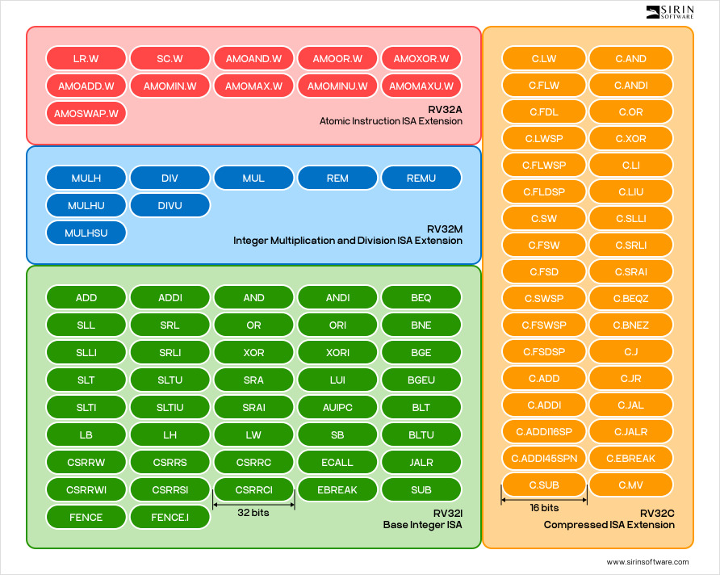

<!-- @import "design/style.css" -->

# **Diseño e Implementación de un Procesador RISC-V Escalar y Segmentado en FPGA**

# Introducción

<p style="text-indent: 2em;">El presente trabajo de investigación consiste en al creación de un procesador escalar y segmentado con una microarquitectura RISC-V, dicha creación será propuesta y representada en el documento desde el punto de vista teórico. El principal objetico del presente trabajo de investigación consiste en la evaluación del funcionamiento y comportamiento del procesador creado en tareas representativas en el campo de la automoción y la inteligencia artificial.</p>

# Objetivos

- Diseñar la microarquitectura de un procesador RISC-V
- Simular el funcionamiento del procesador con diferentes programas (testbench).
- Sintetizar e implementar en el procesador una FPGA para emular RISC-V
- Cargar y validar el funcionamiento del procesador ante diversos eventos.
- Evaluar el rendimiento del procesador en programas representativos de varios sectores.

# Diseño de la microarquitectura del procesador RISC-V

<p style="text-indent: 2em;">Para la creación y desarrollo del diseño del procesador RISC-V se ha utilizado Verilog, compilando un testbench de la CPU mediante iVerilog (Icarus Verilog).

<p style="text-indent: 2em;">La estructura de los ficheros del proyecto que define la arquitectura del procesador y que se encuentran dentro de la carpeta ubicada en ./RISCV_Architecture/ es la siguiente:

```c
        >/.RISCV_Architecture
            >/src
                >alu.v
                >control_unit.v
                >cpu.v
                >data_memory.v
                >immediate_generator.v
                >instruction_memory.v
                >reg_file.v
            >/test
                >cpu_testbench.v
                >data.mem
                >program.mem
            >run.sh

```

## **Fichero alu.v**
<p style="text-indent: 2em;">Los ficheros con formato .v que se encuentran dentro de la carpeta /scr (source) son los encargados del funcionamiento y arquitectura propia del procesador RISC-V. En alu.v (la ALU del procesador) se han definido las entradas por el cana A y B, además del control que determina la operación a realizar y el resultado a devolver, adicionalmente, se ha determinado el funcionamiento de la ALU para las instrucciones: add, sub, and, or, xor, sll y srl (en caso de no ser ninguna de las anteriores la ALU devuelve 0).

alu.v:
```verilog
module alu (
    input [31:0] a,             // Operando A
    input [31:0] b,             // Operando B
    input [3:0] alu_ctrl,       // Control para operacion
    output reg [31:0] result    // Resultado
);

    always @(*) begin
        case (alu_ctrl)
            4'b0000: result = a + b;        // add
            4'b0001: result = a - b;        // sub
            4'b0010: result = a & b;        // and
            4'b0011: result = a | b;        // or
            4'b0100: result = a ^ b;        // xor
            4'b0101: result = a << b[4:0];  // sll
            4'b0110: result = a >> b[4:0];  // srl
            default: result = 0;
        endcase
    end
endmodule
```

## **Fichero control_unit.v**
<p style="text-indent: 2em;">En la control_unit.v (Unidad de control) se ha definido el código de operación, la función de 3 bits y la de 7 bits (por los diferentes formatos de instrucción), la selección del operando B de la entrada a la ALU y las señales de habilitación de lectura y escritura en memoria, la escritura en registro y la selección del dato a desplazar en la etapa WB (Write Back) además del control de operación de la ALU.

<p style="text-indent: 2em;">Cómo instrucciones se ha optado por la creación de las que vienen dada por el repertorio RISC-V32I (instrucciones básicas), entre las que se encuentran: addi, lw, sw, beq y jal (el resto de las operaciónes son mandadas a la ALU para su resolución).

control_unit.v:
```verilog
module control_unit (
    input [6:0] opcode,         // Código de operación
    input [2:0] funct3,         // función de 3 bits
    input [6:0] funct7,         // función de 7 bits
    output reg alu_src,         // Selección de entrada B de la ALU
    output reg mem_read,        // Señal de lectura de memoria
    output reg mem_write,       // Señal de escritura de memoria
    output reg reg_write,       // Señal de escritura en registros
    output reg mem_to_reg,      // Selección escribir en registro (WB)
    output reg [3:0] alu_ctrl   // Control de la operación de la ALU
);

    always @(*) begin
        alu_src = 0;
        mem_read = 0;
        mem_write = 0;
        reg_write = 0;
        mem_to_reg = 0;
        alu_ctrl = 4'b0000;

        case (opcode)
            7'b0010011: begin       // addi
                alu_src = 1;
                reg_write = 1;
                alu_ctrl = 4'b0000; // add
            end
            7'b0000011: begin       // lw
                alu_src = 1;
                mem_read = 1;
                reg_write = 1;
                mem_to_reg = 1;
                alu_ctrl = 4'b0000; // add
            end
            7'b0100011: begin       // sw
                alu_src = 1;
                mem_write = 1;
                alu_ctrl = 4'b0000; // add
            end
            7'b1100011: begin       // beq
                alu_src = 0;
                alu_ctrl = 4'b0001; // sub
            end
            7'b1101111: begin       // jal
                alu_src = 0;
                reg_write = 1;
                mem_to_reg = 0;
                alu_ctrl = 4'b0000; // (irrelevante, salto)
            end
            default: ;
        endcase
    end
endmodule
```

### **Repertorio de instrucciones de RISC-V:**



## **Fichero cpu.v**
<p style="text-indent: 2em;">La cpu.v (Central Unit Process) especifica las etapas que se desarrollan al realizar cada instrucción además del clk (señal de reloj) y del reset (señal de reinicio). El diseño de la arquitectura del procesador creado es la de un procesador segmentado de 5 etapas (IF, ID, EX, MEM, WB) que busca 1 instrucción por ciclo.

cpu.v -> Definición del módulo:
```verilog
module cpu (
    input clk,      // Señal de reloj
    input reset     // Señal de reinicio
);
```

<p style="text-indent: 2em;">La etapa de IF (Instruction Fetch) "lee" la instrucción basandose en el Contador del programa PC (registro de 32 bits inicializado a 0), así como la dirección de la instrucción, tras esto, se realiza el registro del pipeline entre la etapa de IF y la ID (Instrucion Decode) para pasar a dicha etapa.

cpu.v -> IF STAGE:
```verilog
    // ============================================================
    // IF (Instruction Fetch) stage
    // ============================================================
    reg [31:0] pc;          // Contador de programa
    wire [31:0] instr;      // instrucción obtenida de memoria

    // Instancia de la memoria de instrucciones
    instruction_memory imem (
        .addr(pc),              // Dirección de la instrucción = PC
        .instruction(instr)     // Instrucción leída
    );

    // IF/ID registro de pipeline (entre IF e ID)
    reg [31:0] ifid_pc, ifid_instr;
```

<p style="text-indent: 2em;">En la etapa de ID (Instruction Decode) se definen los capos para obtener el tipo de instrucción de la que se trata mediante el código de operación, los registros a utilizar y la función de 3 y 7 bits respectivamente además de definir la salida del banco de registros por las dos vías. Adicionalmente, la etapa hace una llamada al fichero reg_file.v cómo rf en donde se le pasan los parámetros necesarios para el correcto funcionamiento del banco de registros (véase en la explicación del fichero reg_file.v).

cpu.v -> ID STAGE (Primera Parte):
```verilog
    // ============================================================
    // ID (Instruction Decode) stage
    // ============================================================
    // Campos de la instrucción (formato R/I/S/B/J)
    wire [6:0] opcode = ifid_instr[6:0];
    wire [4:0] rs1 = ifid_instr[19:15];
    wire [4:0] rs2 = ifid_instr[24:20];
    wire [4:0] rd  = ifid_instr[11:7];
    wire [2:0] funct3 = ifid_instr[14:12];
    wire [6:0] funct7 = ifid_instr[31:25];

    // Salida del banco de registros
    wire [31:0] reg_data1, reg_data2;

    // Banco de registros: lectura de rs1 y rs2, escritura en rd
    reg_file rf (
        .clk(clk),
        .rs1(rs1),                      // Registro fuente 1
        .rs2(rs2),                      // Registro fuente 2       
        .rd(memwb_rd),                  // Registro destino
        .rd_data(memwb_result),         // Dato a escribir en rd (dedse WB)
        .reg_write(memwb_reg_write),    // Habilita la escritura
        .data1(reg_data1),              // Salida de rs1
        .data2(reg_data2)               // Salida de rs2
    );
```

<p style="text-indent: 2em;">En esta etapa se ha de verificar la lógica del salto dado que el salto dado por una instrución branch, no es el mismo que el dado por la instrucción jal, además, hay que verificar si el salto es o no tomado por el procesador, para ello, se ha implementado un sistema de burbujas para tener un sistema de esperas activas y que el procesador no se quede bloqueado ni se salte instrucciones.

cpu.v -> ID STAGE (Segunda Parte):
```verilog
    // Lógica de salto
    wire is_branch = (opcode == 7'b1100011); // beq
    wire is_jump   = (opcode == 7'b1101111); // jal
    wire branch_taken = (is_branch && reg_data1 == reg_data2);
    wire insert_bubble = (branch_taken || is_jump);

    // Registro de IF/ID con burbuja en saltos
    always @(posedge clk or posedge reset) begin
        if (reset) begin
            pc <= 0;
            ifid_pc <= 0;
            ifid_instr <= 32'b0;
        end else begin
            // Actualiza el PC según el tipo de instrucción
            if (branch_taken) begin
                pc <= pc + branch_offset;
                ifid_pc <= 0;
                ifid_instr <= 32'b0;    // NOP (burbuja por salto)
            end else if (is_jump) begin
                pc <= pc + jump_offset;
                ifid_pc <= 0;
                ifid_instr <= 32'b0;    // NOP (burbuja por salto)
            end else begin
                pc <= pc + 4;
                ifid_pc <= pc;
                ifid_instr <= instr;
            end
        end
    end
```

<p style="text-indent: 2em;">En cuanto a las instrucciones que usan inmediatos (p.ej.: addi), se llama al fichero immediate_generator.v cómo imm_gen al que se le pasa el id de la isntrucción y el inmediato en cuestión (para más información véase la explicación del fichero immediate_generator.v) y se crean los offsets para los saltos y ramas con el mismo inmediato (ya dado por imm_gen).

cpu.v -> ID STAGE (Tercera Parte):
```verilog
    // Inmediato decodificado
    wire [31:0] imm;
    immediate_generator imm_gen (
        .instr(ifid_instr),
        .imm(imm)
    );

    // Offsets para salto y ramas (simple: ambos usan el mismo inmediato)
    wire [31:0] branch_offset = imm;
    wire [31:0] jump_offset = imm;
```

<p style="text-indent: 2em;">Cómo última parte de esta etapa, se llama a control_unit.v cómo ctrl para pasarle la instrucción decodificada y que ésta se encargue de que se ejecute correctamente, tras esto, se realizan los registros del pipeline entre las etapas ID y EX (EXecute) para continuar con la misma.

cpu.v -> ID STAGE (Última Parte):
```verilog
    // Unidad de control: genera señales de control a partir de la instrucción
    wire alu_src, mem_read, mem_write, reg_write, mem_to_reg;
    wire [3:0] alu_ctrl;

    control_unit ctrl (
        .opcode(opcode),            // Código de operación
        .funct3(funct3),            // Función 3bits
        .funct7(funct7),            // Función 7bits
        .alu_src(alu_src),          // Selecctión de entrada B de la ALU
        .mem_read(mem_read),        // Señal de lectura de memoria
        .mem_write(mem_write),      // Señal de escritura de memoria
        .reg_write(reg_write),      // Señal de escritura en registros
        .mem_to_reg(mem_to_reg),    // Selección para WB
        .alu_ctrl(alu_ctrl)         // Operación de la ALU
    );

    // ID/EX registros de pipeline (entre ID y EX)
    reg [31:0] idex_pc, idex_reg_data1, idex_reg_data2, idex_imm;
    reg [3:0]  idex_alu_ctrl;
    reg        idex_alu_src, idex_mem_read, idex_mem_write, idex_reg_write, idex_mem_to_reg;
    reg [4:0]  idex_rd;

    always @(posedge clk) begin
        idex_pc         <= ifid_pc;
        idex_reg_data1  <= reg_data1;
        idex_reg_data2  <= reg_data2;
        idex_imm        <= imm;
        idex_alu_ctrl   <= alu_ctrl;
        idex_alu_src    <= alu_src;
        idex_mem_read   <= mem_read;
        idex_mem_write  <= mem_write;
        idex_reg_write  <= reg_write;
        idex_mem_to_reg <= mem_to_reg;
        idex_rd         <= rd;
    end
```

<p style="text-indent: 2em;">En la etapa de EX (EXecute) se selecciona el segundo opreando de la ALU dependiendo si es un registro o un inmediato y se define el resultado de 32 bits de dicha operación, tras esto, se llama al fichero alu.v (ALU del procesador) para pasarle por parámetro los registros (o inmediato) a utilizar para los cálculos de la unidad, por último se realiza el registro de pipeline entre las etapas EX y MEM (MEMory) para pasar a la misma.

cpu.v -> EX STAGE:
```verilog
    // ============================================================
    // EX (Execute) stage
    // ============================================================
    // Selección del segundo operando de la ALU (reg o inm)
    wire [31:0] alu_in2 = idex_alu_src ? idex_imm : idex_reg_data2;

    // Resultado de la ALU
    wire [31:0] alu_result;

    // Instancia de la ALU
    alu alu_inst (
        .a(idex_reg_data1),
        .b(alu_in2),
        .alu_ctrl(idex_alu_ctrl),
        .result(alu_result)
    );

    // EX/MEM registro de pipeline (entre EX y MEM)
    reg [31:0] exmem_result, exmem_reg_data2;
    reg        exmem_mem_read, exmem_mem_write, exmem_reg_write, exmem_mem_to_reg;
    reg [4:0]  exmem_rd;

    always @(posedge clk) begin
        exmem_result     <= alu_result;
        exmem_reg_data2  <= idex_reg_data2;
        exmem_mem_read   <= idex_mem_read;
        exmem_mem_write  <= idex_mem_write;
        exmem_reg_write  <= idex_reg_write;
        exmem_mem_to_reg <= idex_mem_to_reg;
        exmem_rd         <= idex_rd;
    end
```

<p style="text-indent: 2em;">La etapa de MEM (MEMory) consiste en definir el dato que se obtiene de memoria a través del fichero data_memory, al que se le pasa por parámetro el reloj, la dirección de memoria calculada por la ALU (en la etapa EX), el dato a escribir en memoria, la habilitación de la señal de lectura y escritura en memorai y la salida de dicho dato de memoria (para más información véase la explicación del fichero data_memory.v). Una vez realizado lo anterior, se realiza el registro del pipeline entre las etapas EX y WB (Write Back) para terminar con esta. En este caso, al hacerse en el post-pipeline el guardado de datos en memoria, se realiza a su vez la etapa de WB.

cpu.v -> EX y WB STAGE:
```verilog
    // ============================================================
    // MEM (Memory Access) stage y WB (Write Back) stage
    // ============================================================
    wire [31:0] mem_data_out;

    // Acceso a la memoria de datos
    data_memory dmem (
        .clk(clk),
        .addr(exmem_result),            // Dirección calculada por la ALU
        .write_data(exmem_reg_data2),   // Dato a escribir en caso de SW
        .mem_read(exmem_mem_read),      // Señal de lectura
        .mem_write(exmem_mem_write),    // Señal de escritura
        .read_data(mem_data_out)        // Salida de memoria
    );

    // MEM/WB registro de pipeline (entre MEM y WB)
    reg [31:0] memwb_result;
    reg        memwb_reg_write;
    reg [4:0]  memwb_rd;

    always @(posedge clk) begin
        // Selección del dato a escribir en el registro destino
        memwb_result    <= exmem_mem_to_reg ? mem_data_out : exmem_result;
        memwb_reg_write <= exmem_reg_write;
        memwb_rd        <= exmem_rd;
    end
endmodule
```

## **Fichero data_memory.v**
<p style="text-indent: 2em;">La data_memory.v (memoria de datos) es un fichero que define la cantidad de palabras que almacena la memoria de datos, en este caso, se ha optado por una memoria de 1KB total, es decir, 256 palabras. Para usar el módulo, es necesaria la señal de reloj, así cómo la dirección, el dato a escribir, la señal de escritura y lectura en memoria y una variable en donde almacenar el dato leído. Los datos de memoria vienen dados por un archivo exadecimal (test/data.mem) que contiene 1KB de palabras a 0.

<p style="text-indent: 2em;">En el caso de que la señal de escritura en memoria esté activa, se escribe el dato en cuestión y en caso de que la señal de lecutar esté activa, se lee el dato que ocupa la dirección de memoria dada y si hay información, devuelve la lectura de todo 0. Cómo última adición a este fichero, hay una tarea que se encarga de mostrar las primeras 16 palabras (64 bytes), esto con el objetivo de mostrar los resultados en pruebas futuras.

data_memory.v:
```verilog
module data_memory (
    input clk,
    input [31:0] addr,
    input [31:0] write_data,
    input mem_read,
    input mem_write,
    output reg [31:0] read_data
);
    // Memoria de 256 palabras de 32 bits (1 KB total)
    reg [31:0] memory [0:255];

    // Carga inicial desde archivo hexadecimal
    initial begin
        $readmemh("test/data.mem", memory);
    end

    // Escritura en flanco de subida si mem_write está activo
    always @(posedge clk) begin
        if (mem_write) begin
            memory[addr[9:2]] <= write_data;  // Dirección alineada por palabra
        end
    end

    // Lectura combinacional si mem_read está activo
    always @(*) begin
        if (mem_read) begin
            read_data = memory[addr[9:2]];
        end else begin
            read_data = 32'b0;
        end
    end

    // Tarea para imprimir los primeros 16 valores (64 bytes)
    task print_memory;
        integer i;
        begin
            $display("==== Contenido de la memoria de datos ====");
            for (i = 0; i < 16; i = i + 1) begin
                $display("mem[0x%0h] = %0d (0x%08x)", i * 4, memory[i], memory[i]);
            end
        end
    endtask
endmodule
```

## **Fichero immediate_generator.v**
<p style="text-indent: 2em;">El fichero immediate_generator (generador de inmediatos) contiene un módulo al que se le pasa una instrucción de 32 bits, se extrae el código de operación y dependiendo del mismo, se clasifica por tipo de instrucción (I, S, B, J).

immediate_generator.v:
```verilog
module immediate_generator (
    input [31:0] instr,     // Instrucción de 32 bits
    output reg [31:0] imm   // Valor inmediato
);
    wire [6:0] opcode = instr[6:0]; // Extraer el opcode de la instrucción

    always @(*) begin
        case (opcode)
            // I-type
            7'b0000011, 7'b0010011:    
                imm = {{20{instr[31]}}, instr[31:20]};
            // S-type
            7'b0100011:                 
                imm = {{20{instr[31]}}, instr[31:25], instr[11:7]};
            // B-type
            7'b1100011: 
                imm = {{19{instr[31]}}, instr[31], instr[7], instr[30:25], instr[11:8], 1'b0};
            // J-type
            7'b1101111: 
                imm = {{11{instr[31]}}, instr[31], instr[19:12], instr[20], instr[30:21], 1'b0};
            default:
                imm = 32'b0;
        endcase
    end
endmodule
```

## **Fichero instruction_memory.v**
<p style="text-indent: 2em;">Este fichero contiene la memoria de instrucciones, para el uso de su módulo es necesaria la dirección de la instrucción a leer y una variable para almacenar dicha instrucción una vez se obtenga. El tamaño de la memoria de instrucciones, de manera similar a la memoria de datos, es de 1KB, es decir, 256 palabras, las instrucciones vienen dadas por el fichero con nombre (test/program.mem) en donde las primeras líneas tienen lo siguiente:

program.mem:
```bash
00a00093    // addi x1, x0, 10     ; x1 = 10
01400113    // addi x2, x0, 20     ; x2 = 20
0020813    // add x3, x1, x2      ; x3 = x1 + x2 = 30
00312023    // sw x3, 0(x2)        ; mem[20] = x3
00012183    // lw x3, 0(x2)        ; x3 = mem[20]
0000006f    // jal x0, 0           ; bucle infinito
00000013
...
00000013
```

<p style="text-indent: 2em;">Una vez obtenida la instrucción, se muestran por orden las 3 primeras instrucciones cómo depuración de que el procesador lee correctamente las mismas. Por último se alinea a 4 bytes la memoria.

instruction_memory.v:
```verilog
module instruction_memory (
    input  [31:0] addr,         // Dirección de la instrucción
    output [31:0] instruction   // instrucción leída
);
    reg [31:0] memory [0:255];  // Memoria de inst. de 256 palabras

    initial begin
        $readmemh("test/program.mem", memory);
        $display("\n==== INSTRUCCIONES CARGADAS ====");
        $display("0: %h", memory[0], " -> addi x1, x0, 10");
        $display("1: %h", memory[1], " -> addi x2, x0, 20");
        $display("2: %h", memory[2], " -> add x3, x1, x2");
    end

    assign instruction = memory[addr[9:2]]; // Alineado a 4 bytes
endmodule
```

## **Fichero reg_file.v**
<p style="text-indent: 2em;">El fichero reg_file.v se encarga de obtener las salidas registros pertenecientes a la fuente 1 y 2 del banco de registros, para ello es necesario pasarle dos parámetros para guardar la salida de los registros, así cómo los registros fuentes (dirección) y el destino y una señal de activación de escritura en registro. Por último, se realiza una tarea para imprimir los primero registros de la simulación a método de depuración del correcto funcionamiento del procesador.

reg_file.v:
```verilog
module reg_file (
    input clk,              // Reloj del sistema
    input [4:0] rs1,        // Registro fuente 1
    input [4:0] rs2,        // Registro fuente 2
    input [4:0] rd,         // Registro destino
    input [31:0] rd_data,   // Dato a escribir en el registro destino
    input reg_write,        // Habilita la escritura en el registro destino
    output [31:0] data1,    // Salida del registro fuente 1
    output [31:0] data2     // Salida del registro fuente 2
);

    reg [31:0] registers[0:31];

    assign data1 = registers[rs1];
    assign data2 = registers[rs2];

    integer i;
    initial begin
        for (i = 0; i < 32; i = i + 1) begin
            registers[i] = 0;
        end
    end

    always @(posedge clk) begin
        if (reg_write && rd != 0)
            registers[rd] <= rd_data;
    end

    // Task para imprimir los registros en la simulación
    task print_registers;
        integer j;
        begin
            $display("==== Banco de registros ====");
            for (j = 0; j < 16; j = j + 1) begin
                $display("x%0d = %0d", j, registers[j]);
            end
        end
    endtask
endmodule
```

## **Fichero cpu_testbench.v**
<p style="text-indent: 2em;">Este fichero ejecuta una prueba del procesador, para ello, se define una escala de tiempo de 1ns/1ps además de instanciar el DUT (Device Under Test) con su propio clk y su reset, el reloj se inicializa con un periodo de 10ns y el proceso principal de prueba consiste en ejecutar el programa y tras esperar a que acaben de ejecutarse las instrucciones, el programa imprime un mensaje de estado final del procesador y llama a las tareas creadas en instruction_memory.v y data_memory.v para mostrar su estado.

cpu_testbench.v:
```verilog
`timescale 1ns / 1ps

module cpu_testbench;

    // Señales de testbench
    reg clk;
    reg reset;

    // Instancia del DUT (Device Under Test)
    cpu uut (
        .clk(clk),
        .reset(reset)
    );

    // Generador de reloj: periodo de 10 ns
    always begin
        #5 clk = ~clk;
    end

    // Proceso principal de prueba
    initial begin
        // Inicialización
        clk = 0;
        reset = 1;

        // Espera un par de ciclos con reset activo
        #20;
        reset = 0;

        // Espera suficiente para que se ejecuten instrucciones
        #5000000;

        // Imprime registros y memoria
        $display("\n==== ESTADO FINAL DEL PROCESADOR ====");
        uut.rf.print_registers();     // Banco de registros
        uut.dmem.print_memory();      // Memoria de datos

        // Finaliza la simulación
        $finish;
    end

endmodule
```

### **Diagrama del procesador RISC-V creado**:


Para ejecutar las pruebas del procesador, sólo se ha decargar el proyecto y realizar los pasos siguientes:

```bash
# Locate in the project directory
cd ./RISCV_Architecture

# Project compilation
iverilog -o cpu_testbench.vvp src/*.v test/cpu_testbench.v

# Simulate
vvp cpu_testbench.vvp
```

Dichos pasos están recogidos dentro del fichero run.sh y el resultado de dicha ejecución debe verse tal que:

# Programa de prueba del procesador RISC-V creado

### **Ejecución del cpu_testbench:**
```bash
==== INSTRUCCIONES CARGADAS ====
0: 00a00093 -> addi x1, x0, 10
1: 01400113 -> addi x2, x0, 20
2: 002081b3 -> add x3, x1, x2

==== ESTADO FINAL DEL PROCESADOR ====

==== BANCO DE REGISTROS ====
x0 = 0
x1 = 10
x2 = 20
x3 = 30
x4 = 0
x5 = 0
x6 = 0
x7 = 0
x8 = 0
x9 = 0
x10 = 0
x11 = 0
x12 = 0
x13 = 0
x14 = 0
x15 = 0

==== CONTENIDO DE LA MEMORIA DE DATOS ====
mem[0x0] = 0 (0x00000000)
mem[0x4] = 0 (0x00000000)
mem[0x8] = 0 (0x00000000)
mem[0xc] = 0 (0x00000000)
mem[0x10] = 0 (0x00000000)
mem[0x14] = 0 (0x00000000)
mem[0x18] = 0 (0x00000000)
mem[0x1c] = 0 (0x00000000)
mem[0x20] = 0 (0x00000000)
mem[0x24] = 0 (0x00000000)
mem[0x28] = 0 (0x00000000)
mem[0x2c] = 0 (0x00000000)
mem[0x30] = 0 (0x00000000)
mem[0x34] = 0 (0x00000000)
mem[0x38] = 0 (0x00000000)
mem[0x3c] = 0 (0x00000000)

test/cpu_testbench.v:39: $finish called at 5000020000 (1ps)
```

# Implementación y emulación de una FPGA del procesador RISC-V

